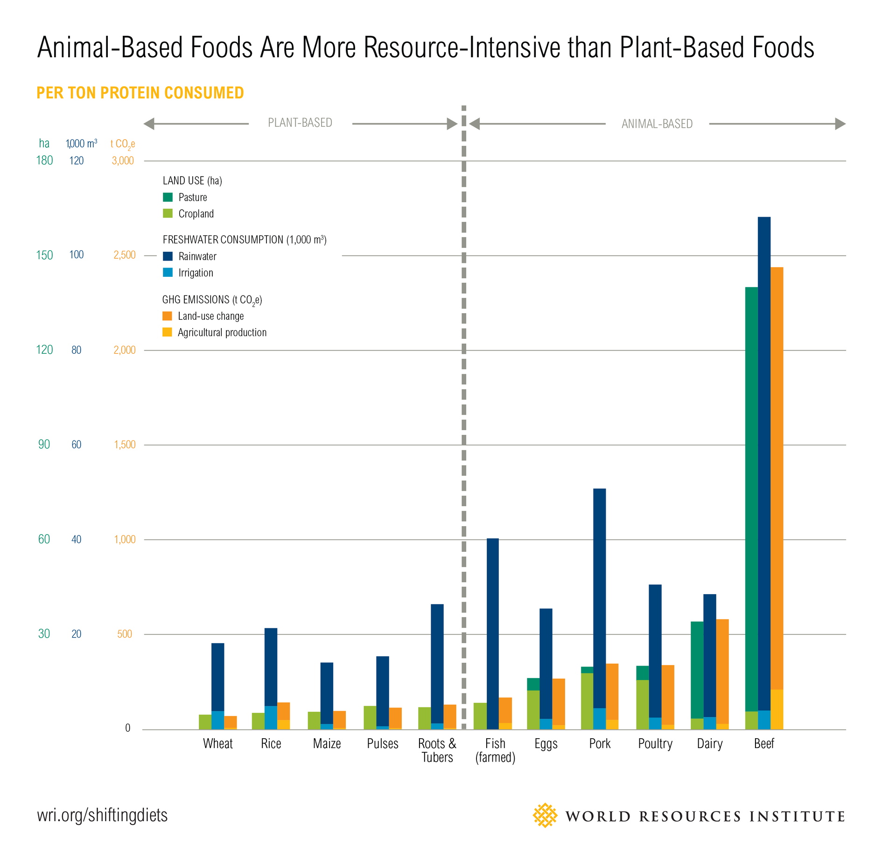
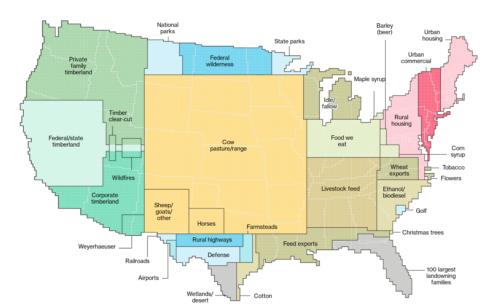
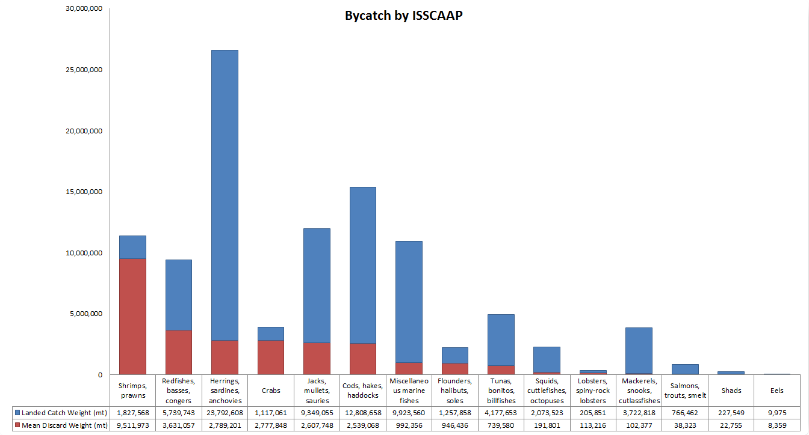
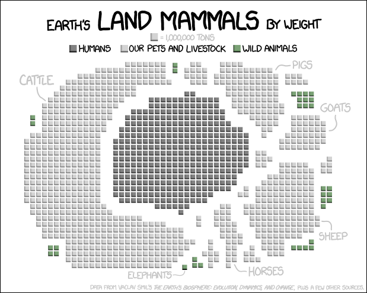

General statistics

[Source with sources](https://www.reddit.com/r/ZeroWaste/comments/b37vfo/the_negative_effects_of_animal_products_cannot_be/)

### Land water and air

### Land use in the USA

40% of the land in the contiguous United States is used for either pasture, rangeland, or growing crops for animals.

### What about the sea?

### Mass of humans compared with animals

